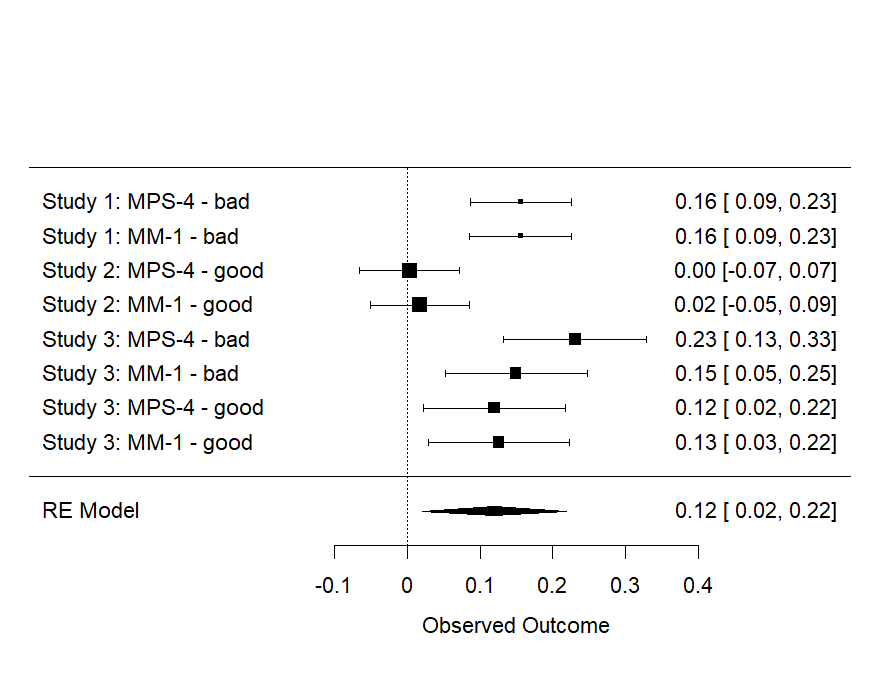

```{r Discussionsetup, include=FALSE}
knitr::opts_chunk$set(echo = FALSE, include = FALSE)
# knitr::opts_chunk$set(eval = TRUE, echo = TRUE)
#knitr::opts_chunk$set(include = FALSE)
```


```{r}
library("papaja")
library(metap)
library(desnum)
#library("wordcountaddin")
#wordcountaddin::word_count("Introduction.Rmd")
getwd()
#devtools::install_github("benmarwick/wordcountaddin", type = "source", dependencies = TRUE)
```

# Internal Meta Analyses

In order to examine whether the observed effects held across studies, we conducted a series of internal meta-analyses. The first set of meta-analyses includes only the studies reported in the main text of this manuscript, while the second set of meta-analyses additionally includes the studies only reported in the supplementary materials. In both cases, we report one overall meta-analysis, investigating the presence of the dilution effect for both bad characters and good characters together. Following this, we also report two additional meta-analyses testing for the presence of the dilution effect for bad characters and good characters separately. 


```{r include=FALSE}

#### Overall dilution effect ####

# all_ps <-
#   c(# MPS-4  MM-1
#      .0001, .0001  # Study 1
#     ,.624 , .267   # Study 2
#     ,.060 , .008   # Study 3 Bad
#     ,.009 , .0001  # Study 3 Good
#     ,.095 , .029   # Study 4
#     ,.221 , .140   # Study 5 Bad
#     ,.002 , .0001  # Study 5 Good
# )

rm(list = ls())

load("S1_effect_stats.RData")
load("S2_effect_stats.RData")
load("S3_effect_stats.RData")

load("S1_table_data.RData")
load("S2_table_data.RData")
load("s3both_table_data.RData")
load("s3bad_table_data.RData")
load("s3good_table_data.RData")

load("supp_S1_effect_stats.RData")
load("supp_S2_effect_stats.RData")
load("supp_S3_effect_stats.RData")


m_fun <- function(x){deparse(substitute(x))
  m <- x
  
  c(
    m$study,
    as.numeric(m$x1)
    ,as.numeric(m$x2)
    ,as.numeric(m$s1)
    ,as.numeric(m$s2)
    ,as.numeric(m$n1)
    ,as.numeric(m$n2)
    ,as.numeric(m$s_pooled)
    ,as.numeric(m$d)
    ,as.numeric(m$vd)
    ,as.numeric(m$sed)
    ,as.numeric(m$ci_upper)
    ,as.numeric(m$ci_lower)
    ,as.numeric(m$p)
    ,as.numeric(m$d_paired))
}

# m_fun <- function(x){deparse(substitute(x))}

test_bad_rtot <- `colnames<-`(
  rbind.data.frame(
    m_fun(s1_rtot_stats)
    ,m_fun(s3bad_rtot_stats)
    # ,m_fun(supp_s2bad_rtot_stats)
    # ,m_fun(supp_s3bad_rtot_stats)
  ),
  names(s1_rtot_stats))


test_good_rtot <- `colnames<-`(
  rbind.data.frame(
    m_fun(s2_rtot_stats)
    ,m_fun(s3good_rtot_stats)
    # ,m_fun(supp_s1_rtot_stats)
    # ,m_fun(supp_s2good_rtot_stats)
    # ,m_fun(supp_s3good_rtot_stats)
  ),
  names(s1_rtot_stats))


test_bad_M1 <- `colnames<-`(
  rbind.data.frame(
    m_fun(s1_M1_stats)
    ,m_fun(s3bad_M1_stats)
    # ,m_fun(supp_s2bad_M1_stats)
    # ,m_fun(supp_s3bad_M1_stats)
  ),
  names(s1_rtot_stats))


test_good_M1 <- `colnames<-`(
  rbind.data.frame(
    m_fun(s2_M1_stats)
    ,m_fun(s3good_M1_stats)
    # ,m_fun(supp_s1_M1_stats)
    # ,m_fun(supp_s2good_M1_stats)
    # ,m_fun(supp_s3good_M1_stats)
  ),
  names(s1_rtot_stats))


test_good_both <- `colnames<-`(
  rbind.data.frame(
    m_fun(s2_M1_stats)
    ,m_fun(s3good_M1_stats)
    ,m_fun(supp_s1_M1_stats)
    ,m_fun(supp_s2good_M1_stats)
    ,m_fun(supp_s3good_M1_stats)
    ,m_fun(s2_rtot_stats)
    ,m_fun(s3good_rtot_stats)
    ,m_fun(supp_s1_rtot_stats)
    ,m_fun(supp_s2good_rtot_stats)
    ,m_fun(supp_s3good_rtot_stats)
  ),
  names(s1_rtot_stats))


test_good_both$measure <- c(
  rep("MM-1",5),
  rep("MPS-4",5)
)


x <- test_good_both

x$studyorder <- c(2,3,4,5,6,2,3,4,5,6)  

x <- x[order(x$studyorder),]


paste(x$study,": ",x$measure, sep = "")

x$valence <- rep("good")

x$lab <- paste(x$study,": ",x$measure, " - ", x$valence, sep = "")


test_good_both <- x

test_bad_both <- `colnames<-`(
  rbind.data.frame(
    m_fun(s1_M1_stats)
    ,m_fun(s3bad_M1_stats)
    # ,m_fun(supp_s1_M1_stats)
    ,m_fun(supp_s2bad_M1_stats)
    ,m_fun(supp_s3bad_M1_stats)
    ,m_fun(s1_rtot_stats)
    ,m_fun(s3bad_rtot_stats)
    # ,m_fun(supp_s1_rtot_stats)
    ,m_fun(supp_s2bad_rtot_stats)
    ,m_fun(supp_s3bad_rtot_stats)
  ),
  names(s1_rtot_stats))

test_bad_both$measure <- c(
  rep("MM-1",4),
  rep("MPS-4",4)
)


x <- test_bad_both

x$studyorder <- c(1,3,5,6,1,3,5,6)  

x <- x[order(x$studyorder),]


paste(x$study,": ",x$measure, sep = "")


x$valence <- rep("bad")

x$lab <- paste(x$study,": ",x$measure, " - ", x$valence, sep = "")

test_bad_both <- x


test_both <- rbind.data.frame(test_good_both,test_bad_both)
sqrt(as.numeric(test_both$d)*as.numeric(test_both$d))

test_both$d_absolute <- sqrt(as.numeric(test_both$d)*as.numeric(test_both$d))

# meta-analysis with continuout outcome
# comb.fixed/comb.random: indicator whether a fix/random effect mata-analysis to be conducted.
# sm: Three different types of summary measures to choose,standardized mean difference (SMD),mean difference (MD), ratio of means (ROM)
meta1 =  meta::metacont(as.numeric(n1), as.numeric(x1), as.numeric(s1), 
                        as.numeric(n2), as.numeric(x2), as.numeric(s2),
                        common = T , random = T, studlab = study,
                        data = test_bad_rtot, sm = "SMD") 
meta2 =  meta::metacont(as.numeric(n1), as.numeric(x1), as.numeric(s1), 
                        as.numeric(n2), as.numeric(x2), as.numeric(s2),
                        common = T , random = T, studlab = study,
                        data = test_bad_M1, sm = "SMD") 
meta3 =  meta::metacont(as.numeric(n1), as.numeric(x1), as.numeric(s1), 
                        as.numeric(n2), as.numeric(x2), as.numeric(s2),
                        common = T , random = T, studlab = study,
                        data = test_good_rtot, sm = "SMD") 
meta4 =  meta::metacont(as.numeric(n1), as.numeric(x1), as.numeric(s1), 
                        as.numeric(n2), as.numeric(x2), as.numeric(s2),
                        common = T , random = T, studlab = study,
                        data = test_good_M1, sm = "SMD") 
meta5 =  meta::metacont(as.numeric(n1), as.numeric(x1), as.numeric(s1), 
                        as.numeric(n2), as.numeric(x2), as.numeric(s2),
                        common = T , random = T, studlab = study,
                        data = test_good_both, sm = "SMD") 
meta6 =  meta::metacont(as.numeric(n1), as.numeric(x1), as.numeric(s1), 
                        as.numeric(n2), as.numeric(x2), as.numeric(s2),
                        common = T , random = T, studlab = study,
                        data = test_bad_both, sm = "SMD") 

summary(meta1)
summary(meta2)
summary(meta3)
summary(meta4)
summary(meta5)
summary(meta6)


meta::forest(meta1, leftcols=c("studlab"))
meta::forest(meta2, leftcols=c("studlab"))
meta::forest(meta3, leftcols=c("studlab"))
meta::forest(meta4, leftcols=c("studlab"))
meta::forest(meta5, leftcols=c("studlab"))
meta::forest(meta6, leftcols=c("studlab"))

#####

# install.packages("dmetar")
library(metafor)

x <- test_both

# x <- x[which(x$study %in% c("Study 1", "Study 2","Study 3"))]
# x <- x %>% dplyr::filter(, study %in% c("Study 1", "Study 2","Study 3"))

x
x_within <- x[which(x$study!="Study S3"),]
x_between <- x[which(x$study=="Study S3"),]

x_within$d_for_meta <- x_within$d_paired
x_between$d_for_meta <- x_between$d
x <- rbind.data.frame(x_within,x_between)

x <- x[order(x$measure,decreasing = T),]
x <- x[order(x$valence,decreasing = F),]
x <- x[order(x$studyorder),]
x
x$ntot <- as.numeric(x$n1)#+as.numeric(x$n2)

#x <- x[1:8,]
#x <- x[which(x$valence=="good"),]

# escalc(measure="MC"
#        ,x1i=as.numeric(n1)
#        ,x2i=as.numeric(n2)
#        ,m1i=as.numeric(x1)
#        ,m2i=as.numeric(x2)
#        ,sd1i=as.numeric(s1)
#        ,sd2i=as.numeric(s2)
#        ,data=x)


x$d_for_meta_absolute <- sqrt(as.numeric(x$d_for_meta)*as.numeric(x$d_for_meta))
x$d_for_meta_absolute <- sqrt(as.numeric(x$d_for_meta)*as.numeric(x$d_for_meta))


x

m_multi <- metafor::rma.mv(as.numeric(d_for_meta_absolute),
                  as.numeric(vd),
                  W=ntot,# (n1+n2),
                  slab = lab,
                  random = ~ 1 | study/measure/valence,
                  method = "ML",
                  test = "z",
                  dfs = "contain",
                  data = x) 

summary(m_multi)

metafor::forest(m_multi)


x <- test_bad_both


x_within <- x[which(x$study!="Study S3"),]
x_between <- x[which(x$study=="Study S3"),]

x_within$d_for_meta <- x_within$d_paired
x_between$d_for_meta <- x_between$d
x <- rbind.data.frame(x_within,x_between)


x$ntot <- as.numeric(x$n1)#+as.numeric(x$n2)

x <- x[order(x$measure,decreasing = T),]
x <- x[order(x$studyorder),]

m_multi <- metafor::rma.mv(as.numeric(d_for_meta),
                  as.numeric(vd),
                  W = ntot,
                  slab = lab,
                  random = ~ 1 | study/measure,
                  method = "REML",
                  test = "z",
                  dfs = "contain",
                  data = x) 


summary(m_multi)


meta::forest(m_multi)


x <- test_good_both


x_within <- x[which(x$study!="Study S3"),]
x_between <- x[which(x$study=="Study S3"),]

x_within$d_for_meta <- x_within$d_paired
x_between$d_for_meta <- x_between$d
x <- rbind.data.frame(x_within,x_between)


x$ntot <- as.numeric(x$n1)#+as.numeric(x$n2)

x <- x[order(x$measure,decreasing = T),]
x <- x[order(x$studyorder),]

m_multi <- metafor::rma.mv(as.numeric(d_paired),
                  as.numeric(vd),
                  W = ntot,
                  slab = lab,
                  random = ~ 1 | study/measure,
                  method = "REML",
                  test = "z",
                  dfs = "contain",
                  data = x) 


summary(m_multi)


meta::forest(m_multi)


```


## Studies 1-3: Meta Analysis


### Both

```{r}

x <- test_both

# x <- x[which(x$study %in% c("Study 1", "Study 2","Study 3"))]
# x <- x %>% dplyr::filter(, study %in% c("Study 1", "Study 2","Study 3"))

x
x_within <- x[which(x$study!="Study S3"),]
x_between <- x[which(x$study=="Study S3"),]

x_within$d_for_meta <- x_within$d_paired
x_between$d_for_meta <- x_between$d
x <- rbind.data.frame(x_within,x_between)

x <- x[order(x$measure,decreasing = T),]
x <- x[order(x$valence,decreasing = F),]
x <- x[order(x$studyorder),]
x
x$ntot <- as.numeric(x$n1)#+as.numeric(x$n2)

#x <- x[1:8,]
#x <- x[which(x$valence=="good"),]

# escalc(measure="MC"
#        ,x1i=as.numeric(n1)
#        ,x2i=as.numeric(n2)
#        ,m1i=as.numeric(x1)
#        ,m2i=as.numeric(x2)
#        ,sd1i=as.numeric(s1)
#        ,sd2i=as.numeric(s2)
#        ,data=x)


x$d_for_meta_absolute <- sqrt(as.numeric(x$d_for_meta)*as.numeric(x$d_for_meta))
x$d_for_meta_absolute <- sqrt(as.numeric(x$d_for_meta)*as.numeric(x$d_for_meta))

x
x <- x[1:8,]


m_multi <- metafor::rma.mv(as.numeric(d_for_meta_absolute),
                  as.numeric(vd),
                  W=ntot,
                  slab = lab,
                  random = ~ 1 | study/valence/measure,
                  method = "REML",
                  test = "z",
                  data = x) 

m_multi <- metafor::rma.mv(as.numeric(d_for_meta_absolute),
                  as.numeric(vd),
                  W=ntot,
                  slab = lab,
                  random = ~ 1 | study/valence/measure,
                  method = "REML",
                  test = "z",
                  data = x) 

summary(m_multi)

metafor::forest(m_multi)

png(file='meta1.png'
    ,width = 880, height = 680, units = "px", pointsize = 22) # Open PNG device with specific file name
metafor::forest(m_multi) # Plot the forest
dev.off()

figure_meta1 <- metafor::forest(m_multi)


z <- summary(m_multi)

meta_estimate <- round(z$beta, digits=2)
meta_se <- round(z$se, digits=2)
meta_z <- round(z$zval, digits=2)
meta_p <- z$pval
meta_cilower <- round(z$ci.lb, digits=2)
meta_ciupper <- round(z$ci.ub, digits=2)


```

Our first meta-analysis examined Studies 1, 2, and 3. Testing for an overall dilution effect across both bad characters and good characters, and across both measures (MPS-4 and MM-1). We computed the absolute value for all effect sizes. In order to account for the nested structure of our data (i.e., multiple effect sizes being reported from each included study), we included random effects for Study (Study 1/2/3), Valence (good/bad), and Measure (MPS-4/MM-1). Overall, there was a significant dilution effect across studies, for both good and bad characters, and for both measures,
*d~pooled~* = `r meta_estimate`,
*SE* = `r meta_se`,
*z* = `r meta_z`,
*p* `r paste(p_report(meta_p))`,
95% CI [`r meta_cilower`, `r meta_ciupper`].




### Bad

```{r}


x <- test_bad_both


x_within <- x[which(x$study!="Study S3"),]
x_between <- x[which(x$study=="Study S3"),]

x_within$d_for_meta <- x_within$d_paired
x_between$d_for_meta <- x_between$d
x <- rbind.data.frame(x_within,x_between)


x$ntot <- as.numeric(x$n1)#+as.numeric(x$n2)

x <- x[order(x$measure,decreasing = T),]
x <- x[order(x$studyorder),]

x <- x[1:4,]

m_multi <- metafor::rma.mv(as.numeric(d_for_meta),
                  as.numeric(vd),
                  W = ntot,
                  slab = lab,
                  random = ~ 1 | study/measure,
                  method = "REML",
                  test = "z",
                  data = x) 


summary(m_multi)


meta::forest(m_multi)


z <- summary(m_multi)

meta_estimate <- round(z$beta, digits=2)
meta_se <- round(z$se, digits=2)
meta_z <- round(z$zval, digits=2)
meta_p <- z$pval
meta_cilower <- round(z$ci.lb, digits=2)
meta_ciupper <- round(z$ci.ub, digits=2)


```

Next examined the presence of an overall dilution effect for bad characters across both measures for Studies 1 and 3. Again we included random effects for each study, as well as for measure. Overall, there was a significant dilution for bad characters, across both studies for both measures,
*d~pooled~* = `r meta_estimate`,
*SE* = `r meta_se`,
*z* = `r meta_z`,
*p* `r paste(p_report(meta_p))`,
95% CI [`r meta_cilower`, `r meta_ciupper`].

### Good

```{r}

x <- test_good_both


x_within <- x[which(x$study!="Study S3"),]
x_between <- x[which(x$study=="Study S3"),]

x_within$d_for_meta <- x_within$d_paired
x_between$d_for_meta <- x_between$d
x <- rbind.data.frame(x_within,x_between)


x$ntot <- as.numeric(x$n1)#+as.numeric(x$n2)

x <- x[order(x$measure,decreasing = T),]
x <- x[order(x$studyorder),]
x
x <- x[1:4,]


m_multi <- metafor::rma.mv(as.numeric(d_paired),
                  as.numeric(vd),
                  W = ntot,
                  slab = lab,
                  random = ~ 1 | study/measure,
                  method = "REML",
                  test = "z",
                  data = x) 


summary(m_multi)


meta::forest(m_multi)


z <- summary(m_multi)

meta_estimate <- round(z$beta, digits=2)
meta_se <- round(z$se, digits=2)
meta_z <- round(z$zval, digits=2)
meta_p <- z$pval
meta_cilower <- round(z$ci.lb, digits=2)
meta_ciupper <- round(z$ci.ub, digits=2)


```


We then examined the presence of an overall dilution effect for good characters across both measures for Studies 1 and 3. Again we included random effects for each study, as well as for measure. Overall, there was no significant dilution for good characters, across both studies for either measures,
*d~pooled~* = `r meta_estimate`,
*SE* = `r meta_se`,
*z* = `r meta_z`,
*p* `r paste(p_report(meta_p))`,
95% CI [`r meta_cilower`, `r meta_ciupper`].

## All Studies

### Both

```{r}

x <- test_both

# x <- x[which(x$study %in% c("Study 1", "Study 2","Study 3"))]
# x <- x %>% dplyr::filter(, study %in% c("Study 1", "Study 2","Study 3"))

x
x_within <- x[which(x$study!="Study S3"),]
x_between <- x[which(x$study=="Study S3"),]

x_within$d_for_meta <- x_within$d_paired
x_between$d_for_meta <- x_between$d
x <- rbind.data.frame(x_within,x_between)

x <- x[order(x$measure,decreasing = T),]
x <- x[order(x$valence,decreasing = F),]
x <- x[order(x$studyorder),]
x
x$ntot <- as.numeric(x$n1)#+as.numeric(x$n2)

#x <- x[1:8,]
#x <- x[which(x$valence=="good"),]

# escalc(measure="MC"
#        ,x1i=as.numeric(n1)
#        ,x2i=as.numeric(n2)
#        ,m1i=as.numeric(x1)
#        ,m2i=as.numeric(x2)
#        ,sd1i=as.numeric(s1)
#        ,sd2i=as.numeric(s2)
#        ,data=x)


x$d_for_meta_absolute <- sqrt(as.numeric(x$d_for_meta)*as.numeric(x$d_for_meta))
x$d_for_meta_absolute <- sqrt(as.numeric(x$d_for_meta)*as.numeric(x$d_for_meta))


x

m_multi <- metafor::rma.mv(as.numeric(d_for_meta_absolute),
                  as.numeric(vd),
                  W=ntot,# (n1+n2),
                  slab = lab,
                  random = ~ 1 | study/measure/valence,
                  method = "REML",
                  test = "z",
                  data = x) 

summary(m_multi)

metafor::forest(m_multi)


png(file='meta2.png'
    ,width = 880, height = 1080, units = "px", pointsize = 22) # Open PNG device with specific file name
metafor::forest(m_multi) # Plot the forest
dev.off()

figure_meta1 <- metafor::forest(m_multi)


z <- summary(m_multi)

meta_estimate <- round(z$beta, digits=2)
meta_se <- round(z$se, digits=2)
meta_z <- round(z$zval, digits=2)
meta_p <- z$pval
meta_cilower <- round(z$ci.lb, digits=2)
meta_ciupper <- round(z$ci.ub, digits=2)


```


We then proceeded to re-run the above meta-analyses but to additionally include the supplementary studies. Other than the inclusion of additional studies, the meta-analyses described below are the same as those already reported. We first included effect sizes for both bad characters and good characters, for both measures (MPS-4 and MM-1), with absolute values for all effect sizes and random effects for Study (Study 1/2/3/S1/S2/S3), Valence (good/bad), and Measure (MPS-4/MM-1). Second we test the effect for bad characters only, and third we test for the effect for good characters only.
Overall, there was a significant dilution effect across all studies, for both good and bad characters, and for both measures,
*d~pooled~* = `r meta_estimate`,
*SE* = `r meta_se`,
*z* = `r meta_z`,
*p* `r paste(p_report(meta_p))`,
95% CI [`r meta_cilower`, `r meta_ciupper`].


### Bad


```{r}


x <- test_bad_both


x_within <- x[which(x$study!="Study S3"),]
x_between <- x[which(x$study=="Study S3"),]

x_within$d_for_meta <- x_within$d_paired
x_between$d_for_meta <- x_between$d
x <- rbind.data.frame(x_within,x_between)


x$ntot <- as.numeric(x$n1)#+as.numeric(x$n2)

x <- x[order(x$measure,decreasing = T),]
x <- x[order(x$studyorder),]

m_multi <- metafor::rma.mv(as.numeric(d_for_meta),
                  as.numeric(vd),
                  W = ntot,
                  slab = lab,
                  random = ~ 1 | study/measure,
                  method = "ML",
                  test = "z",
                  data = x) 


summary(m_multi)


meta::forest(m_multi)


z <- summary(m_multi)

meta_estimate <- round(z$beta, digits=2)
meta_se <- round(z$se, digits=2)
meta_z <- round(z$zval, digits=2)
meta_p <- z$pval
meta_cilower <- round(z$ci.lb, digits=2)
meta_ciupper <- round(z$ci.ub, digits=2)


```

Overall, there was a significant dilution for bad characters across all studies for both measures,
*d~pooled~* = `r meta_estimate`,
*SE* = `r meta_se`,
*z* = `r meta_z`,
*p* `r paste(p_report(meta_p))`,
95% CI [`r meta_cilower`, `r meta_ciupper`].


### Good

```{r}

x <- test_good_both


x_within <- x[which(x$study!="Study S3"),]
x_between <- x[which(x$study=="Study S3"),]

x_within$d_for_meta <- x_within$d_paired
x_between$d_for_meta <- x_between$d
x <- rbind.data.frame(x_within,x_between)


x$ntot <- as.numeric(x$n1)#+as.numeric(x$n2)

x <- x[order(x$measure,decreasing = T),]
x <- x[order(x$studyorder),]

m_multi <- metafor::rma.mv(as.numeric(d_paired),
                  as.numeric(vd),
                  W = ntot,
                  slab = lab,
                  random = ~ 1 | study/measure,
                  method = "REML",
                  test = "z",
                  data = x) 


summary(m_multi)


meta::forest(m_multi)


z <- summary(m_multi)

meta_estimate <- round(z$beta, digits=2)
meta_se <- round(z$se, digits=2)
meta_z <- round(z$zval, digits=2)
meta_p <- z$pval
meta_cilower <- round(z$ci.lb, digits=2)
meta_ciupper <- round(z$ci.ub, digits=2)


```

Overall, there was a significant dilution for good characters, across all studies and for both measures,
*d~pooled~* = `r meta_estimate`,
*SE* = `r meta_se`,
*z* = `r meta_z`,
*p* `r paste(p_report(meta_p))`,
95% CI [`r meta_cilower`, `r meta_ciupper`].


```{r include=FALSE}


load("S1_table_data.RData")
load("S2_table_data.RData")
load("s3bad_table_data.RData")
load("s3good_table_data.RData")


table_for_manuscript <- rbind.data.frame(
  s1_rtot_for_table, s1_M1_for_table
  , s2_rtot_for_table, s2_M1_for_table
  , s3bad_rtot_for_table, s3bad_M1_for_table
  , s3good_rtot_for_table, s3good_M1_for_table
)


ps <- function(y){
  y <- round(y, digits = 3)
  if(as.numeric(sqrt( y*y) ) <.001) print(paste0("<", " ", ".001","**"), quote = FALSE)
  else if(as.numeric(sqrt( y*y) ) <.05) print(paste0(sub("^(-?)0.", "\\1.", sprintf("%.3f", y
                                                         #                           , quote = FALSE
                                                         )
                                                         ),"*"))
  else if(as.numeric(sqrt( y*y) ) >1) print(paste("-"))
  else print(sub("^(-?)0.", "\\1.", sprintf("%.3f", y)))}


table_for_manuscript
table_for_manuscript$b <- round(table_for_manuscript$b, digits = 3)
table_for_manuscript$SE <- round(table_for_manuscript$SE, digits = 3)
table_for_manuscript$df <- round(table_for_manuscript$df, digits = 3)
table_for_manuscript$t <- round(table_for_manuscript$t, digits = 3)
table_for_manuscript$p <- unlist(
  lapply(table_for_manuscript$p, ps))
#round(table_for_manuscript$p, digits = 3)
table_for_manuscript$p

table_for_manuscript$Mdiag <- round(table_for_manuscript$Mdiag, digits = 1)
table_for_manuscript$SDdiag <- round(table_for_manuscript$SDdiag, digits = 1)
table_for_manuscript$Mnond <- round(table_for_manuscript$Mnond, digits = 1)
table_for_manuscript$SDnond <- round(table_for_manuscript$SDnond, digits = 1)
table_for_manuscript$d <- round(table_for_manuscript$d, digits = 2)
table_for_manuscript$upper <- round(table_for_manuscript$upper, digits = 2)
table_for_manuscript$lower <- round(table_for_manuscript$lower, digits = 2)
table_for_manuscript$variance <- round(table_for_manuscript$variance, digits = 4)
table_for_manuscript$ICC <- round(table_for_manuscript$ICC, digits = 2)

table_for_manuscript <- 
  `rownames<-`(
    table_for_manuscript
    ,
    c("S1Rtot"
      ,"S1M1"
      ,"S2Rtot"
      ,"S2M1"
      ,"S3Rtotbad"
      ,"S3M1bad"
      ,"S3Rtotgood"
      ,"S3M1good"))

table_for_manuscript

write.csv(table_for_manuscript, "table_for_manuscript.csv")

```


# Discussion


