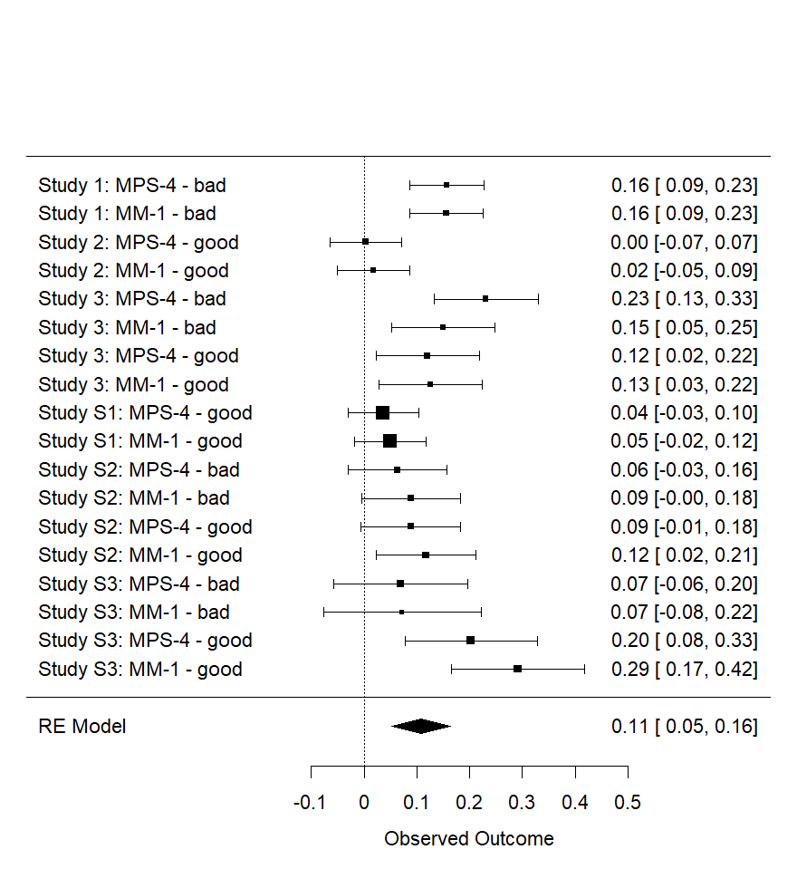

```{r Discussionsetup, include=FALSE}
knitr::opts_chunk$set(echo = FALSE, include = FALSE)
# knitr::opts_chunk$set(eval = TRUE, echo = TRUE)
#knitr::opts_chunk$set(include = FALSE)
```


```{r}
library("papaja")
library(metap)
library(desnum)
#library("wordcountaddin")
#wordcountaddin::word_count("Introduction.Rmd")
getwd()
#devtools::install_github("benmarwick/wordcountaddin", type = "source", dependencies = TRUE)
```


```{r include=FALSE}

#### Overall dilution effect ####

# all_ps <-
#   c(# MPS-4  MM-1
#      .0001, .0001  # Study 1
#     ,.624 , .267   # Study 2
#     ,.060 , .008   # Study 3 Bad
#     ,.009 , .0001  # Study 3 Good
#     ,.095 , .029   # Study 4
#     ,.221 , .140   # Study 5 Bad
#     ,.002 , .0001  # Study 5 Good
# )

rm(list = ls())

load("S1_effect_stats.RData")
load("S2_effect_stats.RData")
load("S3_effect_stats.RData")

load("S1_table_data.RData")
load("S2_table_data.RData")
load("s3both_table_data.RData")
load("s3bad_table_data.RData")
load("s3good_table_data.RData")

load("supp_S1_effect_stats.RData")
load("supp_S2_effect_stats.RData")
load("supp_S3_effect_stats.RData")


m_fun <- function(x){deparse(substitute(x))
  m <- x
  
  c(
    m$study,
    as.numeric(m$x1)
    ,as.numeric(m$x2)
    ,as.numeric(m$s1)
    ,as.numeric(m$s2)
    ,as.numeric(m$n1)
    ,as.numeric(m$n2)
    ,as.numeric(m$s_pooled)
    ,as.numeric(m$d)
    ,as.numeric(m$vd)
    ,as.numeric(m$sed)
    ,as.numeric(m$ci_upper)
    ,as.numeric(m$ci_lower)
    ,as.numeric(m$p)
    ,as.numeric(m$d_paired))
}

# m_fun <- function(x){deparse(substitute(x))}

test_bad_rtot <- `colnames<-`(
  rbind.data.frame(
    m_fun(s1_rtot_stats)
    ,m_fun(s3bad_rtot_stats)
    # ,m_fun(supp_s2bad_rtot_stats)
    # ,m_fun(supp_s3bad_rtot_stats)
  ),
  names(s1_rtot_stats))


test_good_rtot <- `colnames<-`(
  rbind.data.frame(
    m_fun(s2_rtot_stats)
    ,m_fun(s3good_rtot_stats)
    # ,m_fun(supp_s1_rtot_stats)
    # ,m_fun(supp_s2good_rtot_stats)
    # ,m_fun(supp_s3good_rtot_stats)
  ),
  names(s1_rtot_stats))


test_bad_M1 <- `colnames<-`(
  rbind.data.frame(
    m_fun(s1_M1_stats)
    ,m_fun(s3bad_M1_stats)
    # ,m_fun(supp_s2bad_M1_stats)
    # ,m_fun(supp_s3bad_M1_stats)
  ),
  names(s1_rtot_stats))


test_good_M1 <- `colnames<-`(
  rbind.data.frame(
    m_fun(s2_M1_stats)
    ,m_fun(s3good_M1_stats)
    # ,m_fun(supp_s1_M1_stats)
    # ,m_fun(supp_s2good_M1_stats)
    # ,m_fun(supp_s3good_M1_stats)
  ),
  names(s1_rtot_stats))


test_good_both <- `colnames<-`(
  rbind.data.frame(
    m_fun(s2_M1_stats)
    ,m_fun(s3good_M1_stats)
    ,m_fun(supp_s1_M1_stats)
    ,m_fun(supp_s2good_M1_stats)
    ,m_fun(supp_s3good_M1_stats)
    ,m_fun(s2_rtot_stats)
    ,m_fun(s3good_rtot_stats)
    ,m_fun(supp_s1_rtot_stats)
    ,m_fun(supp_s2good_rtot_stats)
    ,m_fun(supp_s3good_rtot_stats)
  ),
  names(s1_rtot_stats))


test_good_both$measure <- c(
  rep("MM-1",5),
  rep("MPS-4",5)
)


x <- test_good_both

x$studyorder <- c(2,3,4,5,6,2,3,4,5,6)  

x <- x[order(x$studyorder),]


paste(x$study,": ",x$measure, sep = "")

x$valence <- rep("good")

x$lab <- paste(x$study,": ",x$measure, " - ", x$valence, sep = "")


test_good_both <- x

test_bad_both <- `colnames<-`(
  rbind.data.frame(
    m_fun(s1_M1_stats)
    ,m_fun(s3bad_M1_stats)
    # ,m_fun(supp_s1_M1_stats)
    ,m_fun(supp_s2bad_M1_stats)
    ,m_fun(supp_s3bad_M1_stats)
    ,m_fun(s1_rtot_stats)
    ,m_fun(s3bad_rtot_stats)
    # ,m_fun(supp_s1_rtot_stats)
    ,m_fun(supp_s2bad_rtot_stats)
    ,m_fun(supp_s3bad_rtot_stats)
  ),
  names(s1_rtot_stats))

test_bad_both$measure <- c(
  rep("MM-1",4),
  rep("MPS-4",4)
)


x <- test_bad_both

x$studyorder <- c(1,3,5,6,1,3,5,6)  

x <- x[order(x$studyorder),]


paste(x$study,": ",x$measure, sep = "")


x$valence <- rep("bad")

x$lab <- paste(x$study,": ",x$measure, " - ", x$valence, sep = "")

test_bad_both <- x


test_both <- rbind.data.frame(test_good_both,test_bad_both)
sqrt(as.numeric(test_both$d)*as.numeric(test_both$d))

test_both$d_absolute <- sqrt(as.numeric(test_both$d)*as.numeric(test_both$d))

# meta-analysis with continuout outcome
# comb.fixed/comb.random: indicator whether a fix/random effect mata-analysis to be conducted.
# sm: Three different types of summary measures to choose,standardized mean difference (SMD),mean difference (MD), ratio of means (ROM)
meta1 =  meta::metacont(as.numeric(n1), as.numeric(x1), as.numeric(s1), 
                        as.numeric(n2), as.numeric(x2), as.numeric(s2),
                        common = T , random = T, studlab = study,
                        data = test_bad_rtot, sm = "SMD") 
meta2 =  meta::metacont(as.numeric(n1), as.numeric(x1), as.numeric(s1), 
                        as.numeric(n2), as.numeric(x2), as.numeric(s2),
                        common = T , random = T, studlab = study,
                        data = test_bad_M1, sm = "SMD") 
meta3 =  meta::metacont(as.numeric(n1), as.numeric(x1), as.numeric(s1), 
                        as.numeric(n2), as.numeric(x2), as.numeric(s2),
                        common = T , random = T, studlab = study,
                        data = test_good_rtot, sm = "SMD") 
meta4 =  meta::metacont(as.numeric(n1), as.numeric(x1), as.numeric(s1), 
                        as.numeric(n2), as.numeric(x2), as.numeric(s2),
                        common = T , random = T, studlab = study,
                        data = test_good_M1, sm = "SMD") 
meta5 =  meta::metacont(as.numeric(n1), as.numeric(x1), as.numeric(s1), 
                        as.numeric(n2), as.numeric(x2), as.numeric(s2),
                        common = T , random = T, studlab = study,
                        data = test_good_both, sm = "SMD") 
meta6 =  meta::metacont(as.numeric(n1), as.numeric(x1), as.numeric(s1), 
                        as.numeric(n2), as.numeric(x2), as.numeric(s2),
                        common = T , random = T, studlab = study,
                        data = test_bad_both, sm = "SMD") 

summary(meta1)
summary(meta2)
summary(meta3)
summary(meta4)
summary(meta5)
summary(meta6)


meta::forest(meta1, leftcols=c("studlab"))
meta::forest(meta2, leftcols=c("studlab"))
meta::forest(meta3, leftcols=c("studlab"))
meta::forest(meta4, leftcols=c("studlab"))
meta::forest(meta5, leftcols=c("studlab"))
meta::forest(meta6, leftcols=c("studlab"))

#####

# install.packages("dmetar")
library(metafor)

x <- test_both

# x <- x[which(x$study %in% c("Study 1", "Study 2","Study 3"))]
# x <- x %>% dplyr::filter(, study %in% c("Study 1", "Study 2","Study 3"))

x
x_within <- x[which(x$study!="Study S3"),]
x_between <- x[which(x$study=="Study S3"),]

x_within$d_for_meta <- x_within$d_paired
x_between$d_for_meta <- x_between$d
x <- rbind.data.frame(x_within,x_between)

x <- x[order(x$measure,decreasing = T),]
x <- x[order(x$valence,decreasing = F),]
x <- x[order(x$studyorder),]
x
x$ntot <- as.numeric(x$n1)#+as.numeric(x$n2)

#x <- x[1:8,]
#x <- x[which(x$valence=="good"),]

# escalc(measure="MC"
#        ,x1i=as.numeric(n1)
#        ,x2i=as.numeric(n2)
#        ,m1i=as.numeric(x1)
#        ,m2i=as.numeric(x2)
#        ,sd1i=as.numeric(s1)
#        ,sd2i=as.numeric(s2)
#        ,data=x)


x$d_for_meta_absolute <- sqrt(as.numeric(x$d_for_meta)*as.numeric(x$d_for_meta))
x$d_for_meta_absolute <- sqrt(as.numeric(x$d_for_meta)*as.numeric(x$d_for_meta))


x

m_multi <- metafor::rma.mv(as.numeric(d_for_meta_absolute),
                  as.numeric(vd),
                  W=ntot,# (n1+n2),
                  slab = lab,
                  random = ~ 1 | study/measure/valence,
                  method = "ML",
                  test = "z",
                  dfs = "contain",
                  data = x) 

summary(m_multi)

metafor::forest(m_multi)


x <- test_bad_both


x_within <- x[which(x$study!="Study S3"),]
x_between <- x[which(x$study=="Study S3"),]

x_within$d_for_meta <- x_within$d_paired
x_between$d_for_meta <- x_between$d
x <- rbind.data.frame(x_within,x_between)


x$ntot <- as.numeric(x$n1)#+as.numeric(x$n2)

x <- x[order(x$measure,decreasing = T),]
x <- x[order(x$studyorder),]

m_multi <- metafor::rma.mv(as.numeric(d_for_meta),
                  as.numeric(vd),
                  W = ntot,
                  slab = lab,
                  random = ~ 1 | study/measure,
                  method = "REML",
                  test = "z",
                  dfs = "contain",
                  data = x) 


summary(m_multi)


meta::forest(m_multi)


x <- test_good_both


x_within <- x[which(x$study!="Study S3"),]
x_between <- x[which(x$study=="Study S3"),]

x_within$d_for_meta <- x_within$d_paired
x_between$d_for_meta <- x_between$d
x <- rbind.data.frame(x_within,x_between)


x$ntot <- as.numeric(x$n1)#+as.numeric(x$n2)

x <- x[order(x$measure,decreasing = T),]
x <- x[order(x$studyorder),]

m_multi <- metafor::rma.mv(as.numeric(d_paired),
                  as.numeric(vd),
                  W = ntot,
                  slab = lab,
                  random = ~ 1 | study/measure,
                  method = "REML",
                  test = "z",
                  dfs = "contain",
                  data = x) 


summary(m_multi)


meta::forest(m_multi)


```

# Meta-analyses and Forest Plots

```{r}

x <- test_both

# x <- x[which(x$study %in% c("Study 1", "Study 2","Study 3"))]
# x <- x %>% dplyr::filter(, study %in% c("Study 1", "Study 2","Study 3"))

x
x_within <- x[which(x$study!="Study S3"),]
x_between <- x[which(x$study=="Study S3"),]

x_within$d_for_meta <- x_within$d_paired
x_between$d_for_meta <- x_between$d
x <- rbind.data.frame(x_within,x_between)

x <- x[order(x$measure,decreasing = T),]
x <- x[order(x$valence,decreasing = F),]
x <- x[order(x$studyorder),]
x
x$ntot <- as.numeric(x$n1)#+as.numeric(x$n2)

#x <- x[1:8,]
#x <- x[which(x$valence=="good"),]

# escalc(measure="MC"
#        ,x1i=as.numeric(n1)
#        ,x2i=as.numeric(n2)
#        ,m1i=as.numeric(x1)
#        ,m2i=as.numeric(x2)
#        ,sd1i=as.numeric(s1)
#        ,sd2i=as.numeric(s2)
#        ,data=x)


x$d_for_meta_absolute <- sqrt(as.numeric(x$d_for_meta)*as.numeric(x$d_for_meta))
x$d_for_meta_absolute <- sqrt(as.numeric(x$d_for_meta)*as.numeric(x$d_for_meta))

x
x <- x[1:8,]


m_multi <- metafor::rma.mv(as.numeric(d_for_meta_absolute),
                  as.numeric(vd),
                  W=ntot,
                  slab = lab,
                  random = ~ 1 | study/valence/measure,
                  method = "REML",
                  test = "z",
                  data = x) 

m_multi <- metafor::rma.mv(as.numeric(d_for_meta_absolute),
                  as.numeric(vd),
                  W=ntot,
                  slab = lab,
                  random = ~ 1 | study/valence/measure,
                  method = "REML",
                  test = "z",
                  data = x) 

summary(m_multi)

metafor::forest(m_multi)

png(file='meta1.png'
    ,width = 880, height = 680, units = "px", pointsize = 22) # Open PNG device with specific file name
metafor::forest(m_multi) # Plot the forest
dev.off()

figure_meta1 <- metafor::forest(m_multi)


z <- summary(m_multi)

meta_estimate <- round(z$beta, digits=2)
meta_se <- round(z$se, digits=2)
meta_z <- round(z$zval, digits=2)
meta_p <- z$pval
meta_cilower <- round(z$ci.lb, digits=2)
meta_ciupper <- round(z$ci.ub, digits=2)


```

Overall, there was a significant dilution effect across Studies 1-3, for both good and bad characters, and for both measures,
*d~pooled~* = `r meta_estimate`,
*SE* = `r meta_se`,
*z* = `r meta_z`,
*p*  `r paste(p_report(meta_p))`,
95% CI [`r meta_cilower`, `r meta_ciupper`].


```{r}


x <- test_bad_both


x_within <- x[which(x$study!="Study S3"),]
x_between <- x[which(x$study=="Study S3"),]

x_within$d_for_meta <- x_within$d_paired
x_between$d_for_meta <- x_between$d
x <- rbind.data.frame(x_within,x_between)


x$ntot <- as.numeric(x$n1)#+as.numeric(x$n2)

x <- x[order(x$measure,decreasing = T),]
x <- x[order(x$studyorder),]

x <- x[1:4,]

m_multi <- metafor::rma.mv(as.numeric(d_for_meta),
                  as.numeric(vd),
                  W = ntot,
                  slab = lab,
                  random = ~ 1 | study/measure,
                  method = "REML",
                  test = "z",
                  data = x) 


summary(m_multi)


meta::forest(m_multi)


z <- summary(m_multi)

meta_estimate <- round(z$beta, digits=2)
meta_se <- round(z$se, digits=2)
meta_z <- round(z$zval, digits=2)
meta_p <- z$pval
meta_cilower <- round(z$ci.lb, digits=2)
meta_ciupper <- round(z$ci.ub, digits=2)


png(file='meta1bad.png'
    ,width = 1280, height = 580, units = "px", pointsize = 22) # Open PNG device with specific file name
metafor::forest(m_multi) # Plot the forest
dev.off()


```


\pagebreak


Overall, there was a significant dilution effect across Studies 1 and 3, for bad characters, and for both measures,
*d~pooled~* = `r meta_estimate`,
*SE* = `r meta_se`,
*z* = `r meta_z`,
*p*  `r paste(p_report(meta_p))`,
95% CI [`r meta_cilower`, `r meta_ciupper`].


```{r}

x <- test_good_both


x_within <- x[which(x$study!="Study S3"),]
x_between <- x[which(x$study=="Study S3"),]

x_within$d_for_meta <- x_within$d_paired
x_between$d_for_meta <- x_between$d
x <- rbind.data.frame(x_within,x_between)


x$ntot <- as.numeric(x$n1)#+as.numeric(x$n2)

x <- x[order(x$measure,decreasing = T),]
x <- x[order(x$studyorder),]
x
x <- x[1:4,]


m_multi <- metafor::rma.mv(as.numeric(d_paired),
                  as.numeric(vd),
                  W = ntot,
                  slab = lab,
                  random = ~ 1 | study/measure,
                  method = "REML",
                  test = "z",
                  data = x) 


summary(m_multi)


meta::forest(m_multi)


z <- summary(m_multi)

meta_estimate <- round(z$beta, digits=2)
meta_se <- round(z$se, digits=2)
meta_z <- round(z$zval, digits=2)
meta_p <- z$pval
meta_cilower <- round(z$ci.lb, digits=2)
meta_ciupper <- round(z$ci.ub, digits=2)


png(file='meta1good.png'
    ,width = 880, height = 480, units = "px", pointsize = 22) # Open PNG device with specific file name
metafor::forest(m_multi) # Plot the forest
dev.off()


```


\pagebreak


Overall, there was no significant dilution effect across Studies 2 and 3, for good characters, for either measures,
*d~pooled~* = `r meta_estimate`,
*SE* = `r meta_se`,
*z* = `r meta_z`,
*p*  `r paste(p_report(meta_p))`,
95% CI [`r meta_cilower`, `r meta_ciupper`].


```{r}

x <- test_both

# x <- x[which(x$study %in% c("Study 1", "Study 2","Study 3"))]
# x <- x %>% dplyr::filter(, study %in% c("Study 1", "Study 2","Study 3"))

x
x_within <- x[which(x$study!="Study S3"),]
x_between <- x[which(x$study=="Study S3"),]

x_within$d_for_meta <- x_within$d_paired
x_between$d_for_meta <- x_between$d
x <- rbind.data.frame(x_within,x_between)

x <- x[order(x$measure,decreasing = T),]
x <- x[order(x$valence,decreasing = F),]
x <- x[order(x$studyorder),]
x
x$ntot <- as.numeric(x$n1)#+as.numeric(x$n2)

#x <- x[1:8,]
#x <- x[which(x$valence=="good"),]

# escalc(measure="MC"
#        ,x1i=as.numeric(n1)
#        ,x2i=as.numeric(n2)
#        ,m1i=as.numeric(x1)
#        ,m2i=as.numeric(x2)
#        ,sd1i=as.numeric(s1)
#        ,sd2i=as.numeric(s2)
#        ,data=x)


x$d_for_meta_absolute <- sqrt(as.numeric(x$d_for_meta)*as.numeric(x$d_for_meta))
x$d_for_meta_absolute <- sqrt(as.numeric(x$d_for_meta)*as.numeric(x$d_for_meta))


x

m_multi <- metafor::rma.mv(as.numeric(d_for_meta_absolute),
                  as.numeric(vd),
                  W=ntot,# (n1+n2),
                  slab = lab,
                  random = ~ 1 | study/measure/valence,
                  method = "REML",
                  test = "z",
                  data = x) 

summary(m_multi)

metafor::forest(m_multi)


png(file='meta2.png'
    ,width = 880, height = 980, units = "px", pointsize = 22) # Open PNG device with specific file name
metafor::forest(m_multi) # Plot the forest
dev.off()

figure_meta1 <- metafor::forest(m_multi)


z <- summary(m_multi)

meta_estimate <- round(z$beta, digits=2)
meta_se <- round(z$se, digits=2)
meta_z <- round(z$zval, digits=2)
meta_p <- z$pval
meta_cilower <- round(z$ci.lb, digits=2)
meta_ciupper <- round(z$ci.ub, digits=2)


```


\pagebreak


Overall, there was a significant dilution effect across all studies, for bad and good characters, and for both measures,
*d~pooled~* = `r meta_estimate`,
*SE* = `r meta_se`,
*z* = `r meta_z`,
*p*  `r paste(p_report(meta_p))`,
95% CI [`r meta_cilower`, `r meta_ciupper`].




```{r}


x <- test_bad_both


x_within <- x[which(x$study!="Study S3"),]
x_between <- x[which(x$study=="Study S3"),]

x_within$d_for_meta <- x_within$d_paired
x_between$d_for_meta <- x_between$d
x <- rbind.data.frame(x_within,x_between)


x$ntot <- as.numeric(x$n1)#+as.numeric(x$n2)

x <- x[order(x$measure,decreasing = T),]
x <- x[order(x$studyorder),]

m_multi <- metafor::rma.mv(as.numeric(d_for_meta),
                  as.numeric(vd),
                  W = ntot,
                  slab = lab,
                  random = ~ 1 | study/measure,
                  method = "ML",
                  test = "z",
                  data = x) 


summary(m_multi)


meta::forest(m_multi)


z <- summary(m_multi)

meta_estimate <- round(z$beta, digits=2)
meta_se <- round(z$se, digits=2)
meta_z <- round(z$zval, digits=2)
meta_p <- z$pval
meta_cilower <- round(z$ci.lb, digits=2)
meta_ciupper <- round(z$ci.ub, digits=2)


png(file='meta2bad.png'
    ,width = 880, height = 680, units = "px", pointsize = 22) # Open PNG device with specific file name
metafor::forest(m_multi) # Plot the forest
dev.off()


```


\pagebreak


Overall, there was a significant dilution effect across all studies, for bad characters, and for both measures,
*d~pooled~* = `r meta_estimate`,
*SE* = `r meta_se`,
*z* = `r meta_z`,
*p*  `r paste(p_report(meta_p))`,
95% CI [`r meta_cilower`, `r meta_ciupper`].


```{r}

x <- test_good_both


x_within <- x[which(x$study!="Study S3"),]
x_between <- x[which(x$study=="Study S3"),]

x_within$d_for_meta <- x_within$d_paired
x_between$d_for_meta <- x_between$d
x <- rbind.data.frame(x_within,x_between)


x$ntot <- as.numeric(x$n1)#+as.numeric(x$n2)

x <- x[order(x$measure,decreasing = T),]
x <- x[order(x$studyorder),]

m_multi <- metafor::rma.mv(as.numeric(d_paired),
                  as.numeric(vd),
                  W = ntot,
                  slab = lab,
                  random = ~ 1 | study/measure,
                  method = "REML",
                  test = "z",
                  data = x) 


summary(m_multi)


meta::forest(m_multi)


z <- summary(m_multi)

meta_estimate <- round(z$beta, digits=2)
meta_se <- round(z$se, digits=2)
meta_z <- round(z$zval, digits=2)
meta_p <- z$pval
meta_cilower <- round(z$ci.lb, digits=2)
meta_ciupper <- round(z$ci.ub, digits=2)


png(file='meta2good.png'
    ,width = 880, height = 680, units = "px", pointsize = 22) # Open PNG device with specific file name
metafor::forest(m_multi) # Plot the forest
dev.off()

```


\pagebreak


Overall, there was a significant dilution effect across all, for bad characters, and for both measures,
*d~pooled~* = `r meta_estimate`,
*SE* = `r meta_se`,
*z* = `r meta_z`,
*p*  `r paste(p_report(meta_p))`,
95% CI [`r meta_cilower`, `r meta_ciupper`].


